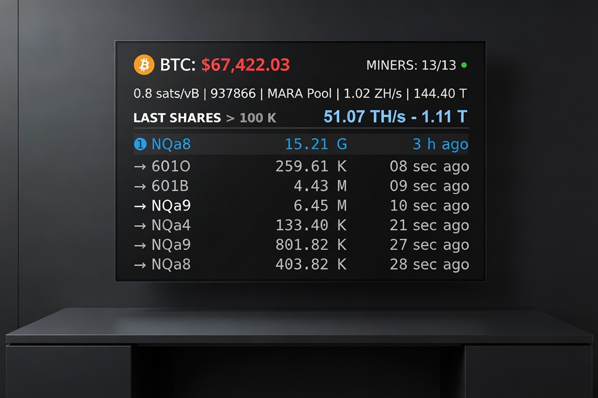
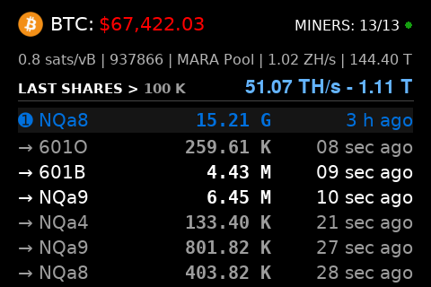
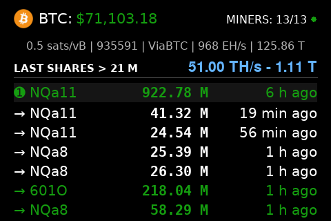
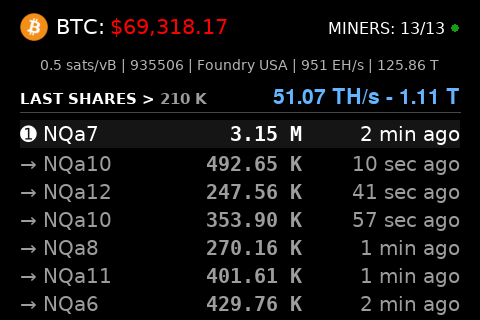

<div align="center">

# RPi Bitcoin Mining Difficulty Meter Display
for Raspberry Pi TFT/HDMI Displays

[](https://www.raspberrypi.com/)
[](https://www.python.org/)
[](https://www.pygame.org/)
[](https://opensource.org/licenses/MIT)



</div>

<br>

<p align="center">Live share difficulties (rarity colors), session best, hashrate, BTC price & network stats in one dashboard.</p>

## Screenshots

<div align="center">
  <table style="width:100%; max-width:900px;">
    <tr>
      <td align="center">
        
      </td>
      <td align="center">
        
      </td>
      <td align="center">
        
      </td>
    </tr>
  </table>
</div>

## Table of Contents
- [Features](#features)
- [Hardware](#hardware)
- [System Prerequisites](#system-prerequisites)
- [Installation](#installation)
- [Project Structure](#project-structure)
- [Configuration Notes](#configuration-notes)
- [Troubleshooting](#troubleshooting)
- [License](#license)
- [Acknowledgments](#acknowledgments)
- [Support The Project](#support-the-project)

## Features

### 📈 Market Data (Binance + Kraken)
- Real-time BTC price (Binance primary with Kraken fallback) via WebSocket
- 24h price change with green/red color coding

### ⛏️  Local Miner Monitoring
- Live accepted share difficulties (above configurable threshold)
- Advanced rarity color system: Poor → Common → Uncommon → Rare → Epic → Legendary
- Session best difficulty highlighted with “➊” marker
- Aggregated stats:
  - Total hashrate (TH/s)
  - Best difficulty across all miners
  - Connected/active miner count
- Global health indicator (green/orange/red circle)

### 🌐 Bitcoin Network Stats (mempool.space)
- Recommended fees (sat/vB)
- Current block height
- Latest block mining pool
- Network hashrate
- Current network difficulty

### ⚙️  Performance & UX
- Mandatory launch modes: `--mode pi` (fullscreen) or `--mode desktop` (windowed)
- Optimized for Raspberry Pi: default 8 FPS
- Auto-scaling with preserved aspect ratio on any display
- Automatic reconnection with exponential backoff
- Configurable via `config.json`

Perfect always-on dashboard for Raspberry Pi 3B+, 4 or 5.

## Hardware

Developed and tested with:
- Raspberry Pi 3B+, 4, 5
- Waveshare 3.5" TFT touchscreen (480×320, XPT2046 controller)
- Standard HDMI monitors (auto-scaled)
- Desktop PC (Linux)

## System Prerequisites

- The Raspberry Pi or PC must be on the same local network as your miners.
- For Raspberry Pi: Make sure `/boot/firmware/config.txt` contains `dtoverlay=vc4-kms-v3d`.

Install system packages:
```bash
sudo apt update && sudo apt install python3-venv python3-pygame libsdl2-dev libegl-dev
```

Add your user to the required groups:
```bash
sudo usermod -aG video,input $USER
```

Log out and log back in (or reboot).

## Installation

1. Clone the repository:
```bash
git clone https://github.com/DozNot/rpi-bitcoin-mining-difficulty-meter-display.git
cd rpi-bitcoin-mining-difficulty-meter-display
```

2. Create and activate a virtual environment (recommended):

**Important**: Use the system-provided python3-pygame package (from apt) for best compatibility with Raspberry Pi's kmsdrm driver.

```bash
python3 -m venv --system-site-packages venv
source venv/bin/activate
```
Why `--system-site-packages`?

→ This allows the `venv` to use the optimized system `pygame` while keeping other dependencies isolated.

3. Install dependencies:
```bash
python3 -m pip install -r requirements.txt
```

4. Copy and edit the configuration file:
```bash
cp config.example.json config.json
nano config.json
```

- Example config.json:
```json
{
    "miner_ips": [
        "192.0.2.100",
        "192.0.2.101",
        "192.0.2.102",
        "192.0.2.103"
    ],
    "ip_to_name": {
        "192.0.2.100": "BitAxe 1",
        "192.0.2.101": "BitAxe 2",
        "192.0.2.102": "NerdQaxe 1",
        "192.0.2.103": "NerdQaxe 2"
    },
    "btc_logo_path": "logos/btc.png",
    "min_diff_threshold": 75000,
    "min_active_hashrate_th": 0.25,
    "data_timeout_sec": 60.0,
    "num_diffs_to_keep": 20,
    "max_lines_on_screen": 6,
    "screen_width": 480,
    "screen_height": 320,
    "target_fps": 8,
    "mempool_update_every": 30.0
}
```
→ Replace IPs with your real miner IP addresses (BitAxe/NerdQaxe/etc.)

5. Run the application:

**On Raspberry Pi:**
```bash
python3 app.py --mode pi
```

**On Desktop/PC:**
```bash
python3 app.py --mode desktop
```

→ The `--mode` flag is **required**.

- Then make it start automatically at boot (systemd, crontab @reboot, etc.) 
- Recommended for a dedicated dashboard

## Project Structure
```bash
rpi-bitcoin-mining-difficulty-meter-display/
├── app.py                  # Main entry point
├── config.json             # User configuration
├── config.example.json     # Template: copy to config.json and edit
├── LICENSE                 # Project license
├── requirements.txt        # Python dependencies
├── assets/                 # Images used in README
│   ├── demo.png            # Demo screenshot
│   ├── btc-qr.png          # BTC QR
│   ├── xmr-qr.png          # XMR QR
│   └── ...                 
├── logos/                  # Crypto logo images
│   └── btc.png                
├── logs/
│   └── app.log             # Rotating log file (INFO/WARNING/ERROR)
├── src/                    # Source code modules
│   ├── __init__.py
│   ├── constants.py        # Constant values and settings
│   ├── data.py             # Price and market data fetching
│   ├── helpers.py          # Utility functions
│   ├── mempool.py          # Mempool/BTC network data
│   ├── miners.py           # Local miner monitoring
│   ├── rendering.py        # Display rendering and drawing logic
│   └── websockets.py       # WebSocket connections for live data
├── README.md               # Project documentation and setup guide
└── SECURITY.md             # Security Policy
```

## Configuration Notes

All paths are relative to the project root.

- `miner_ips`: List of miner IP addresses
- `ip_to_name`: Friendly names for each miner (recommended)
- `min_diff_threshold`: Minimum difficulty to display
- `min_active_hashrate_th`: Minimum TH/s to count as active
- `target_fps`: Default 8 (keep low for minimal CPU)
- `max_lines_on_screen`: Max recent shares shown
- `data_timeout_sec`: Data freshness timeout
- `mempool_update_every`: Network refresh interval (seconds)

## Troubleshooting

- Ensure your device and the miners are on the same network.
- Usage message → You must use `--mode pi` or `--mode desktop`
- Black screen → Use `--system-site-packages`+ check `dtoverlay=vc4-kms-v3d`
- No price → Internet required. Check logs.
- Miners not connecting → Verify IPs, WebSocket enabled on miners.
- No shares → Wait for accepted shares above `min_diff_threshold`

→ Logs: `./logs/app.log`

## License
MIT License – see [LICENSE](LICENSE)

## Acknowledgments
- Price data: Binance and Kraken public APIs
- Network stats: mempool.space
- Home mining community (BitAxe, NerdAxe, OSMU, etc.)

## Support The Project

If this project helps you, consider a small donation. Thank you!

<br>

<div align="center">
<table>
  <tr>
    <th align="center"><strong style="font-size: 1.3em;">[ BITCOIN ]</strong></th>
    <th align="center"><strong style="font-size: 1.3em;">[ MONERO ]</strong></th>
  </tr>
  <tr>
    <td align="center">
      <br><br><br>
    </td>
    <td align="center">
      <br><br><br>
    </td>
  </tr>
</table>
</div>

**Bitcoin:**
```bash
bc1qkaqaxqheejuddrp5604wy592k423vjmk3uu35l
```

**Monero:**
```bash
457KEpgmvXJgNSnrkVs2poFPCVNXxPoqBAnxjSC1T9C3QUSSxXMR3iLFx1LtPc77oUAmoVwHgrh7KGzFugVpc1RCJ9nR3PS
```
